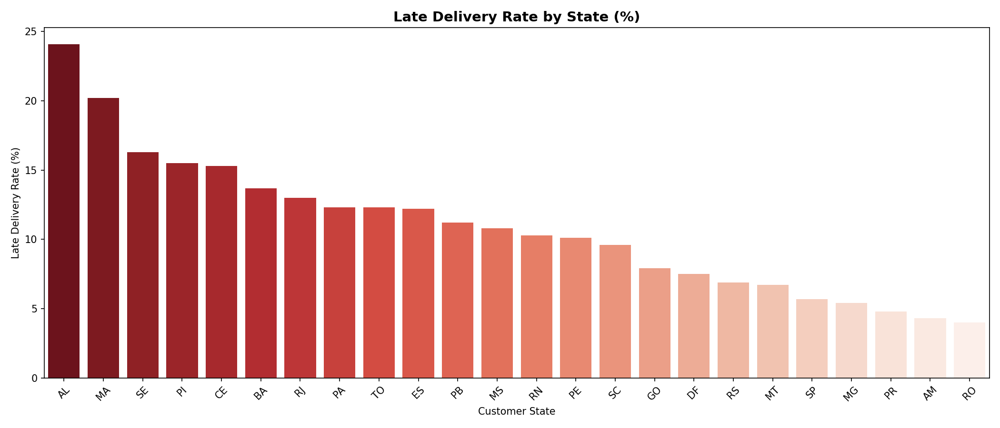
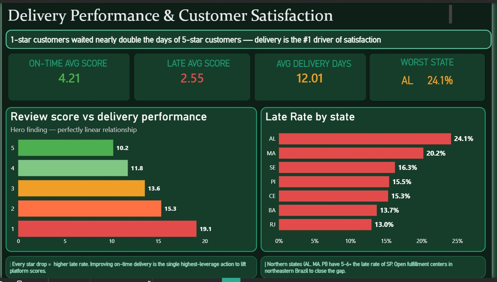

# Last-Mile Failures — Olist E-commerce Analysis

  

> Revenue grew 10× in 18 months — but 1 in 13 delivered orders still arrives late.

## 📊 Executive Summary

I analyzed **99,441 real orders** from Olist, a Brazilian e-commerce marketplace, to understand why customer satisfaction was slipping despite strong revenue growth. The answer: delivery failures were quietly destroying review scores, and the problem was heavily concentrated in specific states and product categories.

- **7.9% of orders arrived late** — and late orders scored 40% lower on reviews (2.55 vs 4.21 out of 5)
- **AL and MA states had 3× the late-delivery rate** of SP — a clear geographic pattern, not random noise
- **18% of sellers drive 80% of revenue** — a Pareto concentration worth addressing

> **Bottom line:** Fixing delivery reliability — especially in underserved northern states — would protect review scores more effectively than any discount campaign.

## 🛠️ Tools Used

- **Python** (pandas, matplotlib, seaborn) — data cleaning and exploratory analysis
- **SQL** (SQLite) — business queries and aggregations
- **Power BI** — interactive 3-page dashboard

## 📁 Dataset

- **Source:** [Olist Brazilian E-commerce](https://www.kaggle.com/datasets/olistbr/brazilian-ecommerce)
- **Scope:** 99,441 orders · 9 tables · 2016–2018

## ▶️ How to Run

**Prerequisites**
```
pip install -r requirements.txt
```

**Steps**
1. Clone the repository:
   ```
   git clone https://github.com/Likhitha37/ecommerce-analysis.git
   ```
2. Download the raw dataset from [Kaggle](https://www.kaggle.com/datasets/olistbr/brazilian-ecommerce) and place the CSV files in a `data/raw/` folder.
3. Run the notebooks in order:
   - `01_data_inspection.ipynb`
   - `02_cleaning.ipynb` — produces `clean_orders.csv`
   - `03_eda.ipynb` — exploratory analysis and charts
   - `04_sql_analysis.ipynb` — SQL queries via SQLite
4. Open `olist_dashboard.pbix` in Power BI Desktop to view the interactive dashboard.

## 🔍 Key Findings

### 1. Revenue grew 10× in 18 months — but growth was masking a problem
Monthly revenue peaked at **R$995K in November 2017**, likely driven by Black Friday. The business was clearly scaling — but that growth was hiding an operational issue building underneath it.

### 2. 7.9% of orders arrived late — and it cost the business dearly
**7,827 customers** waited longer than promised. A small percentage of orders, but an outsized hit to trust.

### 3. Late delivery destroys review scores
On-time orders averaged **4.21/5**. Late orders averaged **2.55/5** — a **40% drop** in satisfaction from a single operational failure.

### 4. The problem is geographic, not random
**AL (24.1%)** and **MA (20.2%)** late-delivery rates are nearly **3× SP's rate (5.6%)**. Northern Brazil is being underserved by the logistics network — this isn't noise, it's a pattern.



### 5. 18% of sellers drive 80% of revenue
A textbook Pareto distribution. The platform is heavily dependent on a small group of top performers — a concentration risk worth addressing before it becomes a liability.

**Putting it together:** these aren't 5 separate problems — they're one problem. Olist scaled order volume 10× faster than it scaled logistics coverage and seller diversity, and that gap is what's showing up as falling review scores in specific regions.

## ⚠️ Limitations

- **Correlation, not causation:** The relationship between late delivery and review score is strong, but this analysis doesn't rule out other factors (e.g. product quality, price) that could independently affect both.
- **Geographic sample size:** AL and MA have far fewer total orders than SP, so their late-rate percentages are more sensitive to small sample swings — directionally reliable, not statistically airtight.
- **Static snapshot:** This dataset covers 2016–2018. Olist's logistics network has likely changed since — findings should be treated as historical, not a live diagnosis.
- **What I'd do differently:** With more time, I'd test whether delivery delay causes the review drop (e.g. via a natural experiment or matched comparison) rather than relying on correlation alone.

## 💡 Business Recommendations

1. **Open fulfillment centers in northeastern Brazil** — AL, MA, and PI have the worst late-delivery rates and sit far from existing seller hubs.
2. **Fix delivery before offering discounts** — every extra day of delay costs roughly 0.4 stars in review score. Discounts won't fix a trust problem.
3. **Build seller growth programs for mid-tier sellers** — reducing dependency on the top 18% lowers concentration risk if a key seller churns.

## 📈 Dashboard

| Overview | Delivery Analysis | Categories & Sellers |
|---|---|---|
|  |  |  |

*Full interactive dashboard: `olist_dashboard.pbix`*

## 📂 Project Structure

```
ecommerce-analysis/
├── notebooks/
│   ├── 01_data_inspection.ipynb
│   ├── 02_cleaning.ipynb
│   ├── 03_eda.ipynb
│   └── 04_sql_analysis.ipynb
├── sql/
│   ├── q1_late_delivery_by_state.sql
│   ├── q2_revenue_by_category.sql
│   ├── q3_delivery_by_category.sql
│   ├── q4_monthly_revenue.sql
│   ├── q5_top_sellers.sql
│   └── q6_review_vs_delivery.sql
├── images/
│   ├── charts/          # 6 EDA charts
│   └── dashboard/        # 3 Power BI dashboard screenshots
├── data/
│   └── clean_orders.csv
├── requirements.txt
├── olist_dashboard.pbix
└── README.md
```

## 🌎 Why a Brazilian Dataset?

Olist has the richest publicly available e-commerce transactional data — 9 real tables, 100K orders, real sellers and reviews. The business problems it surfaces — delivery performance, seller quality, category profitability — mirror what platforms like Meesho, Flipkart, and Amazon India deal with daily. The geography differs; the operational challenges don't.
