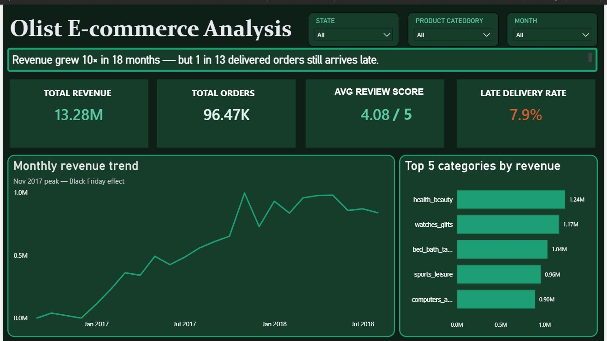
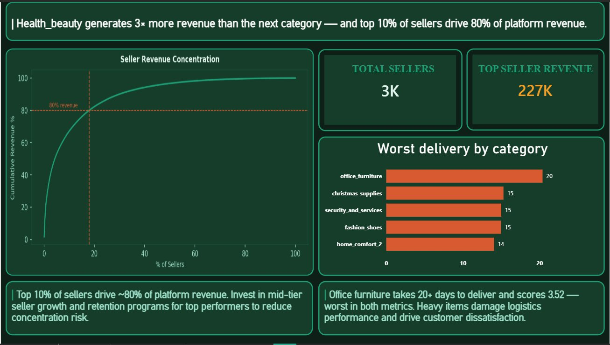

# Last-Mile Failures — Olist E-commerce Analysis

> Revenue grew 10× in 18 months — but 1 in 13 delivered orders still arrives late.

## What this project is about
I analyzed 99,441 real orders from Olist, a Brazilian e-commerce marketplace to understand why customers were unhappy despite strong 
revenue growth ; the same delivery, seller, and category problems 
Indian platforms like Meesho and Flipkart face daily. The short answer: delivery failures were quietly destroying satisfaction scores, and the problem was concentrated in specific states and product categories.

## Tools Used
- **Python** (pandas, matplotlib, seaborn) — data cleaning and EDA
- **SQL** (SQLite) — business queries and aggregations
- **Power BI** — interactive 3-page dashboard

## Dataset
- Source: [Olist Brazilian E-commerce](https://www.kaggle.com/datasets/olistbr/brazilian-ecommerce)
- 99,441 orders · 9 tables · 2016–2018

## Key Findings

**1. Revenue grew 10× in 18 months**
The business was clearly growing — peaking at R$995K in November 2017, likely driven by Black Friday. But growth was masking an operational problem.

**2. 7.9% of orders arrived late**
That's 7,827 customers who waited longer than promised. Small percentage, big impact.

**3. Late delivery destroys review scores**
On-time orders averaged 4.21 out of 5. Late orders averaged 2.55 — a 40% drop in satisfaction from a single operational failure.

**4. The problem is geographic**
AL and MA states had 24.1% and 20.2% late rates — nearly 3× the rate of SP at 5.6%. Northern Brazil is being underserved by the logistics network.

**5. 18% of sellers drive 80% of revenue**
Classic Pareto confirmed. The platform is heavily dependent on a small group of top performers — a concentration risk worth addressing.

## Business Recommendations
1. **Open fulfillment centers in northeastern Brazil** — AL, MA, and PI have the worst late rates and are far from seller hubs
2. **Fix delivery before offering discounts** — every extra day of delay costs roughly 0.4 stars in review score
3. **Build seller growth programs for mid-tier sellers** — reduce dependency on the top 18% to lower concentration risk

## Dashboard

## Project Structure
├── notebooks/
│   ├── 01_data_inspection.ipynb
│   ├── 02_cleaning.ipynb
│   ├── 02_eda.ipynb
│   └── 02_sql_analysis.ipynb
├── sql/
│   ├── q1_late_delivery_by_state.sql
│   ├── q2_revenue_by_category.sql
│   ├── q3_delivery_by_category.sql
│   ├── q4_monthly_revenue.sql
│   ├── q5_top_sellers.sql
│   └── q6_review_vs_delivery.sql
├── outputs/
│   └── clean_orders.csv
└── olist_dashboard.pbix

## Why a Brazilian dataset?
Olist has the richest publicly available e-commerce transactional data — 9 real tables, 100k orders, real sellers and reviews. The business problems it surfaces — delivery performance, seller quality, category profitability — are identical to what Indian platforms like Meesho, Flipkart, and Amazon India deal with daily. The geography is different. The problems aren't.
